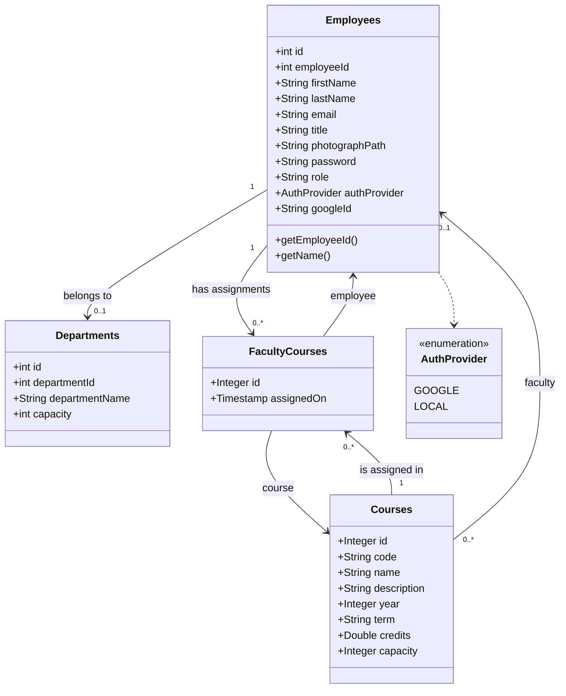

# Class Diagram

```mermaid
classDiagram
    class Employees {
        +int id
        +int employeeId
        +String firstName
        +String lastName
        +String email
        +String title
        +String photographPath
        +String password
        +String role
        +AuthProvider authProvider
        +String googleId
        +getEmployeeId()
        +getName()
    }

    class Courses {
        +Integer id
        +String code
        +String name
        +String description
        +Integer year
        +String term
        +Double credits
        +Integer capacity
    }

    class Departments {
        +int id
        +int departmentId
        +String departmentName
        +int capacity
    }

    class FacultyCourses {
        +Integer id
        +Timestamp assignedOn
    }

    %% Relationships
    Employees "1" --> "0..1" Departments : belongs to
    Employees "1" --> "0..*" FacultyCourses : has assignments
    Courses "1" --> "0..*" FacultyCourses : is assigned in
    
    %% Direct relationship in Courses entity (Legacy/Primary)
    Courses "0..*" --> "0..1" Employees : faculty
    
    %% Link FacultyCourses to Employees and Courses
    FacultyCourses --> Employees : employee
    FacultyCourses --> Courses : course

    %% Enum
    class AuthProvider {
        <<enumeration>>
        GOOGLE
        LOCAL
    }
    Employees ..> AuthProvider
```
